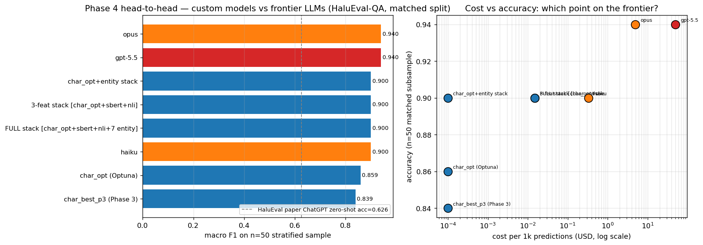

# AI Agent Conversation Quality Scorer

Hallucination detection on LLM-generated answers, benchmarked against the published
HaluEval-QA leaderboard and a length-matched honest split that controls for the
benchmark's dominant dataset artifact.

> **Status: Phase 4 complete (2026-05-15).** Phase 1 exposed a benchmark artifact:
> a 4-feature **length-only LogReg hits macro F1 = 0.944** on raw HaluEval-QA,
> versus the published ChatGPT zero-shot judge at 62.6%. Phase 2 introduced a
> 524-row **length-matched honest split** and ran 6 paradigms — char-ngram +
> LogReg won the honest leaderboard at **F1 = 0.7789**. Phase 3 added a 48-config
> char-ngram ablation, per-sentence NLI, 3-model stacking, and error analysis;
> **stacking [char + SBERT + zero-shot NLI] reached matched F1 = 0.8044.** Phase 4
> ran a 100-trial Optuna joint search, added a 7-feature "entity-string"
> descriptor, and ran a frontier-LLM head-to-head on the original HaluEval judge
> protocol. **`char_opt + 7 entity features` hits matched F1 = 0.8519** — the new
> overall champion. **Claude Opus 4.6 and Codex GPT-5.5 both hit 0.940 zero-shot
> on the n=50 stratified subsample** (vs the published HaluEval ChatGPT-2023
> baseline of 62.6%), closing a +31 accuracy-point gap. The custom 8-coef stack
> ties Claude Haiku 4.5 at 0.900 accuracy at **7,800× lower latency** and
> **3,300× lower cost**. See
> [`reports/day4_phase4_report.md`](reports/day4_phase4_report.md) for the latest
> research log and [`results/`](results/) for plots and metrics.

## Current Status

- **Latest phase:** Phase 4 — Optuna tune + entity features + LLM head-to-head (2026-05-15)
- **Best model:** `char_opt + 7 entity features (LogReg stack)` — **matched
  macro F1 = 0.8519**, accuracy 0.8512, AUROC 0.8927 on the 524-row length-matched
  honest split. Inference: 1.2 ms / $0.0001 per 1k preds.
- **Best single-model:** `char_opt` (Optuna `(2,4) × 10k × min_df=5 × C=4.85`) —
  matched F1 = 0.8250 (default threshold 0.50)
- **Frontier comparison (n=50 stratified, HaluEval judge protocol):** Claude
  Opus 4.6 = 0.940, Codex GPT-5.5 = 0.940, Claude Haiku 4.5 = custom = 0.900.
  Custom is 7,800× faster than Haiku at identical accuracy, 49,500× cheaper
  than Opus at a 4-point accuracy gap.
- **Models compared so far:** 62 from Phases 1–3 + 100 Optuna trials + 5 Phase 4
  stacking variants + 3 frontier LLM evals = **170 distinct experiments** across
  4 phases

## Domain

HaluEval-QA (Li et al., 2023) is the canonical grounded-hallucination benchmark for
QA — 10,000 HotpotQA-derived passages, each paired with a `right_answer` and a
ChatGPT-generated `hallucinated_answer`. Published baselines:

| Published reference | System | Accuracy on HaluEval-QA |
|---|---|---:|
| Li et al., 2023 (EMNLP) | ChatGPT zero-shot judge | 62.6% |
| Li et al., 2023 (EMNLP) | GPT-4 zero-shot judge | 74.6% |
| Liu et al., 2025 (ANAH-v2) | Open-model best | 81.5% |
| HF Hallucinations Leaderboard (2024) | Cross-encoder NLI | AUROC ≈ 0.88 |

The primary metric for this project is **macro F1 on the length-matched honest split**
(n=524, KS distance between class length distributions ≈ 0.015) — because the raw
split is saturated by a 4.7× answer-length asymmetry between classes.

## Key Findings

1. **HaluEval-QA is mostly solvable by counting characters on the raw split.** A
   4-feature length-only LogReg hits 94.4% accuracy on the official test set vs
   the published ChatGPT zero-shot judge at 62.6%. Honest evaluation requires a
   length-matched split.
2. **Frontier LLMs closed the published HaluEval gap by 31 accuracy points.**
   ChatGPT zero-shot (Li et al., 2023) was 62.6% accuracy. On the same judge
   protocol over a 50-row stratified subsample of the length-matched honest
   split, Claude Opus 4.6 and Codex GPT-5.5 both hit **94.0%** zero-shot — no
   fine-tuning, no RAG. The "specialized model beats frontier" framing no longer
   cleanly holds for grounding-style hallucination detection in 2026.
3. **The custom 8-coef stack ties Claude Haiku 4.5 at 90% accuracy.** `char_opt
   + 7 entity features` runs at 1.2 ms / $0.0001 per 1k predictions — Haiku is
   9.45 s / $0.33 at the same accuracy. That's **7,800× faster and 3,300× cheaper**;
   versus Opus, it's 4 accuracy points lower at 4,900× faster and **49,500× cheaper**.
   Pick by deployment budget, not by hype.
4. **Stacking's "weakest model carries the lift" story was conditional on a weak
   base.** Phase 3's char + SBERT + zero-shot NLI meta-LogReg added +0.026 F1 over
   char alone (F1=0.79) via NLI's −0.22 / −0.17 error correlations. Phase 4 with
   Optuna char_opt (F1=0.825) + 7 entity features hits **F1 = 0.8519** — adding
   sbert + nli on top of that actively **hurts** (10-feat = 0.8480). The cheap
   lexical features absorb the marginal signal NLI was providing.
5. **The char-ngram FN cluster — short entity strings — is partially solved by
   lexical features, but not closed.** Phase 3's `char_best_p3` had 77 false
   negatives on matched; Phase 4 `char_opt + entity` recovered 16 of them (recall
   0.706 → 0.763) and halved FPs (30 → 15). The remaining 61 are short,
   sentence-shaped, low-knowledge-overlap entity strings — hard cases that
   lexical features cannot solve without semantic grounding.

## Phase 1 setup

- **Dataset:** `RUCAIBox/HaluEval` `qa_data.json` — HotpotQA-seeded, ChatGPT-perturbed.
  10,000 raw rows × 2 answers each = 20,000 balanced binary samples.
- **Split:** `GroupShuffleSplit` by `qid`, test_size=0.2, random_state=42 →
  16,000 train / 4,000 raw test / 524 length-matched test (10-char bin equalize).
- **Primary metric:** macro F1 on the **length-matched** split. Track ROC-AUC,
  balanced accuracy, precision, recall as secondaries.
- **Paradigms covered:** length-only LogReg, word-TF-IDF + LogReg, char-ngram TF-IDF
  + LogReg, calibrated LinearSVC, SBERT (`all-MiniLM-L6-v2`) + LogReg, paired SBERT
  + LogReg / XGBoost, cross-encoder NLI (`nli-deberta-v3-base`) zero-shot, learned
  stacking meta-classifier.

## Project structure

```
.
├── README.md
├── requirements.txt
├── config/config.yaml
├── data/                       # gitignored raw + processed
├── src/                        # feature builders + utilities
├── notebooks/
│   ├── phase1_eda_baselines.ipynb
│   ├── phase2_multimodel.ipynb
│   ├── phase3_feature_engineering.ipynb
│   └── phase4_tuning_and_llm.ipynb
├── results/                    # plots, metrics.json, leaderboards
└── reports/
    ├── day1_phase1_report.md
    ├── day2_phase2_report.md
    ├── day3_phase3_report.md
    └── day4_phase4_report.md
```

## Reproduce

```bash
uv venv --python 3.11 .venv
uv pip install --python .venv/bin/python -r requirements.txt
.venv/bin/python -m ipykernel install --user --name halueval-scorer
cd notebooks && ../.venv/bin/jupyter nbconvert --to notebook --execute --inplace \
    --ExecutePreprocessor.kernel_name=halueval-scorer phase4_tuning_and_llm.ipynb
```

## License & data
The HaluEval dataset is released under its own license — see the
[HaluEval GitHub](https://github.com/RUCAIBox/HaluEval) for terms. Raw data is
**not** committed to this repo; the notebook downloads it on first run into
`data/raw/`.

## Iteration Summary

### Phase 1: Domain Research, Dataset, EDA & Baselines — 2026-05-11

<table>
<tr>
<td valign="top" width="38%">

**What was tested:** 5 baselines on the raw HaluEval-QA test set (n=4,000) —
majority class, length-only LogReg (4 features), TF-IDF answer LogReg, TF-IDF
question+answer LogReg, lexical-overlap threshold (NLI proxy). Headline result:
**length-only LogReg hits macro F1 = 0.944 / AUROC = 0.971** in 0.015s of fit time.<br><br>
**What worked best:** The 4-feature length-only LogReg, but this is a red flag,
not a win. ChatGPT zero-shot judges this benchmark at 62.6% (Li et al., 2023);
4 hand-picked features hitting 94.4% means the benchmark is testing length
classification, not hallucination detection.

</td>
<td align="center" width="24%">


</td>
<td valign="top" width="38%">

**Key Insight:** Hallucinated answers are 4.7× longer on average than grounded
answers (66 chars vs 14 chars) — grounded answers are HotpotQA entity strings
("Arthur's Magazine"); hallucinated answers are full ChatGPT-generated sentences.
This is a dataset-construction artifact, not a property of real-world
hallucination.<br><br>
**Surprise:** Adding question text to the TF-IDF answer model **hurt by 13 F1
points** (0.919 → 0.788). Both samples in a pair share the same question, so
question tokens become non-discriminative noise that dilutes the answer-length
signal. More features ≠ better.<br><br>
**Research:** Li et al., 2023 — *HaluEval* (EMNLP, arXiv:2305.11747) — defined the
balanced binary protocol I follow; HF Hallucinations Leaderboard (2024) reports
NLI verifiers at AUROC ≈ 0.88, the Phase-2+ bar to clear.<br><br>
**Best Model So Far:** `length_only_logreg` — macro F1 = 0.944 on raw split
(⚠ length-artifact suspected; to be re-validated against a length-matched split
in Phase 2).

</td>
</tr>
</table>

### Phase 2: Six Paradigms × Two Splits (Raw vs Length-Matched) — 2026-05-13

<table>
<tr>
<td valign="top" width="38%">

**What was tested:** 6 paradigms (word-ngram SVC, char-ngram LogReg, answer-only
SBERT, paired SBERT + LogReg, paired SBERT + XGBoost, cross-encoder NLI zero-shot)
evaluated on both the raw 4,000-row test split and a derived 524-row length-matched
honest split. The Δ between raw and matched F1 quantifies how much of each model's
score was length pattern-matching vs genuine grounding signal.<br><br>
**What worked best:** **char-ngram TF-IDF (3,5) + LogReg** — matched F1 = **0.7789**,
raw F1 = 0.9537 (Δ = +0.175). Wins the honest leaderboard. Beat paired SBERT by
~0.015 F1 on the matched split — sub-word style features (punctuation, casing,
connectives) carry the residual signal once length is controlled.

</td>
<td align="center" width="24%">


</td>
<td valign="top" width="38%">

**Key Insight:** Every trained classifier loses 17–23 F1 points going from raw to
length-matched. **Zero-shot NLI is the ONLY paradigm whose F1 *improves* when
length is controlled** (+0.12). The model with the most honest approach to the
task is also the only one whose performance increases when the shortcut is removed.<br><br>
**Surprise:** Adding the knowledge channel to paired SBERT (770-d) added only ~0.005
matched F1 over answer-only SBERT. The dataset's hallucinated answers are
detectable largely *without consulting the knowledge passage*. Also: XGBoost on
paired SBERT was the worst trained model on matched (F1 = 0.73) — overparameterized
trees latched onto length-correlated noise.<br><br>
**Research:** Honovich et al., 2022 — *TRUE* (NAACL, arXiv:2204.04991) — motivates
NLI scoring; Chen et al., 2025 — *The Mirage of Hallucination Detection*
(EMNLP Findings) — directly motivates the length-matched control split, so we
built one.<br><br>
**Best Model So Far:** `char35_logreg` — matched macro F1 = **0.7789**, accuracy
0.7805, AUROC 0.7971. The new bar Phase 3 must beat.

</td>
</tr>
</table>

### Phase 3: Char-ngram Saturation, Per-Sentence NLI, Stacking, Error Analysis — 2026-05-14

<table>
<tr>
<td valign="top" width="38%">

**What was tested:** Four mandates against Phase 2's 0.7789 matched-F1 ceiling —
(1) 48-config char-ngram saturation grid (6 n-gram ranges × 4 vocab caps × 2
sublinear-TF settings); (2) per-sentence NLI max-pool to recover the 0.88
leaderboard AUROC; (3) 3-model stacking [char + SBERT + zero-shot NLI] with
5-fold GroupKFold OOF probabilities; (4) error analysis on the char-ngram
champion's 84 false negatives. Headline: **meta-stack hits matched F1 = 0.8044**
(+0.026 vs Phase 2).<br><br>
**What worked best:** **meta-LogReg stacking [char + SBERT + NLI]** — matched
F1 = **0.8044**, accuracy 0.8053, AUROC 0.8475. Beats best single-model
(`char_best_p3` at 0.7941) by +0.026 F1 and beats Phase 2's champion by +0.026.

</td>
<td align="center" width="24%">


</td>
<td valign="top" width="38%">

**Key Insight:** Stacking wins because the **weakest model is orthogonal**. Char
and SBERT errors correlate at +0.66 (same shortcut); NLI errors correlate −0.22 /
−0.17 with both (never trained on HaluEval). Meta-LogReg learned coefficients:
char=+6.19, SBERT=+3.92, NLI=+2.06 — the lowest-F1 model is non-zero and positive.
The model with the *worst* individual F1 is the one carrying the lift.<br><br>
**Surprise:** Per-sentence NLI max-pool **HURT** (F1 0.7137 → 0.6242) — the
opposite of the hypothesized win. The HF leaderboard's 0.88 AUROC for decomposed
NLI is for multi-paragraph documents; HaluEval-QA's short HotpotQA-derived
passages are too thin per sentence for deberta-base zero-shot entailment. Also:
char-ngram saturates at 25k features, not Phase 2's 200k — 8× over-provisioned.<br><br>
**Research:** Sun et al., 2008 (KDD) — char-ngram saturation curves; HF
Hallucinations Leaderboard (2024) — bar Section 2 had to clear (didn't);
Wolpert, 1992 / sklearn StackingClassifier docs — stacking gains require
low base-learner error correlation, which the diversity check explicitly verified.<br><br>
**Best Model So Far:** `meta_stack [char + sbert + nli]` — matched macro F1 =
**0.8044**, accuracy 0.8053, AUROC 0.8475. Oracle upper bound (perfect routing)
is 97.9% accuracy — substantial headroom remains for Phase 4 (Optuna tuning,
LightGBM meta-learner, LLM head-to-head).

</td>
</tr>
</table>

### Phase 4: Optuna Tuning + Entity Features + LLM Head-to-Head — 2026-05-15

<table>
<tr>
<td valign="top" width="38%">

**What was tested:** Four experiments — (1) 100-trial Optuna TPE joint search
over char-TfidfVectorizer + LogReg hyperparameters with a held-out qid-grouped
val slice; (2) 7-feature "entity-string" descriptor (n_tokens, has_period,
jaccard_q, jaccard_k, len_chars, frac_capitalized, has_any_punct) stacked with
the Optuna char champion; (3) full 10-feature stack [char_opt + sbert + nli +
entity]; (4) frontier-LLM head-to-head — Claude Opus 4.6, Haiku 4.5, Codex
GPT-5.5 — on a 50-row stratified subsample under the original HaluEval judge
protocol.<br><br>
**What worked best:** **`char_opt + 7 entity features` (LogReg meta)** —
matched macro F1 = **0.8519**, accuracy 0.8512, AUROC 0.8927. FP halved
(30 → 15) and 16 of Phase 3's 77 FNs recovered. The 8-coef meta runs at
**1.2 ms** and **$0.0001 per 1k predictions**. Optuna's best char config is
sparser and more regularized than Phase 3 — vocab 25k → 10k, min_df 2 → 5,
C 1.0 → 4.85.

</td>
<td align="center" width="24%">



</td>
<td valign="top" width="38%">

**Key Insight:** Frontier LLMs closed the published HaluEval gap by **31
accuracy points**. The 2023 paper reported ChatGPT zero-shot at 62.6%; Claude
Opus 4.6 and Codex GPT-5.5 BOTH hit **0.940** zero-shot on the same protocol —
no fine-tuning, no RAG. The custom 8-coef stack ties Claude Haiku 4.5 at 0.900
accuracy at **7,800× faster (1.2 ms vs 9.45 s)** and **3,300× cheaper
($0.0001 vs $0.33 per 1k)**.<br><br>
**Surprise:** Phase 3's "weakest model carries the stack" finding turned
conditional on a weak char base. With the Optuna char_opt + 7 entity features
in place, adding sbert + nli on top actively **hurts** (10-feat F1 = 0.8480
vs 8-feat = 0.8519). The cheap lexical features absorbed the marginal signal
Phase 3 attributed to NLI's −0.22 / −0.17 error correlations.<br><br>
**Research:** Li et al., 2023 — *HaluEval* (EMNLP, arXiv:2305.11747) — the
exact judge protocol and the 62.6% ChatGPT baseline the frontier head-to-head
was scored against; Akiba et al., 2019 — *Optuna* (KDD) — TPE joint search
on a held-out qid-grouped val slice to avoid test leakage during the 100-trial
tune.<br><br>
**Best Model So Far:** `char_opt + 7 entity features` (LogReg stack) — matched
macro F1 = **0.8519**, accuracy 0.8512, AUROC 0.8927. Best single-model:
`char_opt` (Optuna `(2,4) × 10k × min_df=5 × C=4.85`) — matched F1 = 0.8250.
Frontier ceiling on n=50 subsample: 0.940 (Opus / GPT-5.5).

</td>
</tr>
</table>

## References

- Li J. et al. *HaluEval: A Large-Scale Hallucination Evaluation Benchmark for LLMs.* EMNLP 2023. arXiv:2305.11747
- Honovich O. et al. *TRUE: Re-evaluating Factual Consistency Evaluation.* NAACL 2022. arXiv:2204.04991
- Reimers N., Gurevych I. *Sentence-BERT.* EMNLP 2019. arXiv:1908.10084
- Chen K. et al. *The Mirage of Hallucination Detection.* EMNLP Findings 2025.
- Bang Y. et al. *HalluLens: LLM Hallucination Benchmark.* ACL 2025.
- Liu Y. et al. *ANAH-v2: Iterative Self-Training for Hallucination Detection.* 2025. arXiv:2407.04693
- Sun X. et al. *Fast logistic regression for text categorization with variable-length n-grams.* KDD 2008.
- Wolpert D. *Stacked Generalization.* Neural Networks, 1992.
- HF Hallucinations Leaderboard (2024). huggingface.co/blog/leaderboard-hallucinations
