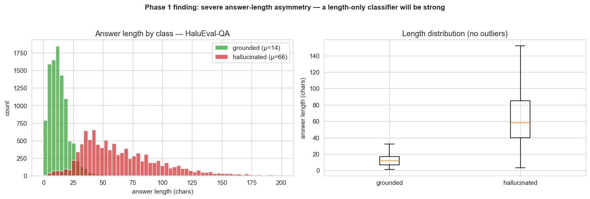
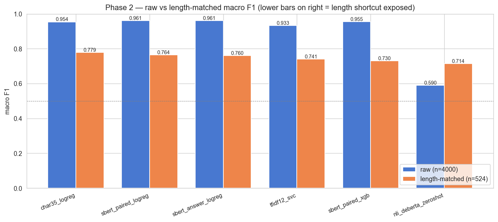
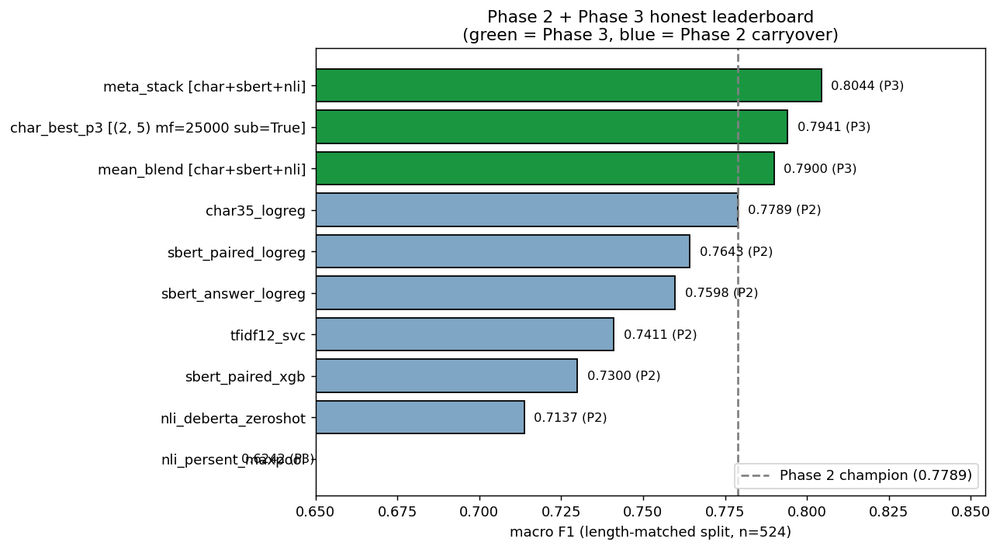

# AI Agent Conversation Quality Scorer

Hallucination detection on LLM-generated answers, benchmarked against the published
HaluEval-QA leaderboard and a length-matched honest split that controls for the
benchmark's dominant dataset artifact.

> **Status: Phase 3 complete (2026-05-14).** Phase 1 exposed a benchmark artifact:
> a 4-feature **length-only LogReg hits macro F1 = 0.944** on raw HaluEval-QA,
> versus the published ChatGPT zero-shot judge at 62.6%. Phase 2 introduced a
> 524-row **length-matched honest split** and ran 6 paradigms — char-ngram +
> LogReg won the honest leaderboard at **F1 = 0.7789**, and zero-shot cross-encoder
> NLI was the only paradigm whose F1 *improved* (+0.12) when length was controlled.
> Phase 3 ran a 48-config char-ngram ablation, a per-sentence NLI experiment, a
> 3-model stacking experiment, and an error analysis on the char-ngram champion.
> **Stacking [char + SBERT + zero-shot NLI] hits matched F1 = 0.8044** —
> the weakest model in the stack (NLI at F1 = 0.62) is the one carrying the +0.026
> lift via negative error correlation. See
> [`reports/day3_phase3_report.md`](reports/day3_phase3_report.md) for the latest
> research log and [`results/`](results/) for plots and metrics.

## Current Status

- **Latest phase:** Phase 3 — feature engineering deep dive (2026-05-14)
- **Best model:** `meta_stack [char + sbert + nli]` — **matched macro F1 = 0.8044**,
  accuracy 0.8053, AUROC 0.8475 on the 524-row length-matched honest split
- **Best single-model:** `char_best_p3` ((2,5) × 25k × sublinear) — matched F1 = 0.7941
- **Models compared so far:** 11 in the cumulative honest leaderboard + 48 char-ngram
  ablation configs + 3 stacking variants = **62 distinct experiments** across 3 phases

## Domain

HaluEval-QA (Li et al., 2023) is the canonical grounded-hallucination benchmark for
QA — 10,000 HotpotQA-derived passages, each paired with a `right_answer` and a
ChatGPT-generated `hallucinated_answer`. Published baselines:

| Published reference | System | Accuracy on HaluEval-QA |
|---|---|---:|
| Li et al., 2023 (EMNLP) | ChatGPT zero-shot judge | 62.6% |
| Li et al., 2023 (EMNLP) | GPT-4 zero-shot judge | 74.6% |
| Liu et al., 2025 (ANAH-v2) | Open-model best | 81.5% |
| HF Hallucinations Leaderboard (2024) | Cross-encoder NLI | AUROC ≈ 0.88 |

The primary metric for this project is **macro F1 on the length-matched honest split**
(n=524, KS distance between class length distributions ≈ 0.015) — because the raw
split is saturated by a 4.7× answer-length asymmetry between classes.

## Key Findings

1. **HaluEval-QA is mostly solvable by counting characters on the raw split.** A
   4-feature length-only LogReg hits 94.4% accuracy on the official test set vs
   the published ChatGPT zero-shot judge at 62.6%. Honest evaluation requires a
   length-matched split.
2. **Stacking's headline is *which* model carries the lift.** Char-ngram (F1=0.79)
   and SBERT (F1=0.76) errors correlate at +0.66 — they're learning the same
   shortcut. Zero-shot NLI (F1=0.62 alone) has error correlations of −0.22 / −0.17
   with the trained models. The meta-LogReg's NLI coefficient (+2.06) is non-zero
   and positive — the weakest model is the one making the stack work.
3. **Char-ngram saturates at 25k features, not 200k.** Phase 2 used `(3,5) × 200k`;
   the Phase 3 48-config ablation showed `(2,5) × 25k × sublinear_tf=True` wins —
   +0.015 matched F1 with **8× fewer features**. Sublinear-TF lift across the grid
   averaged +0.0008 (noise).
4. **Per-sentence NLI max-pool actively hurt** (F1 0.7137 → 0.6242). The HF
   leaderboard's 0.88-AUROC ceiling for decomposed NLI is for multi-paragraph
   sources; HaluEval-QA's short HotpotQA-derived passages are too thin per sentence
   for entailment with deberta-base zero-shot.
5. **The char-ngram champion's 84 false-negatives are short HotpotQA-style entity
   strings.** 2.4 mean tokens, 21% have any sentence-ending punctuation, mean
   predicted P(hallu) = 0.19 — confidently wrong, not borderline. The model has
   learned "long sentence-shaped response ⇒ hallucination" and gets spoofed by
   short entity-string hallucinations.

## Phase 1 setup

- **Dataset:** `RUCAIBox/HaluEval` `qa_data.json` — HotpotQA-seeded, ChatGPT-perturbed.
  10,000 raw rows × 2 answers each = 20,000 balanced binary samples.
- **Split:** `GroupShuffleSplit` by `qid`, test_size=0.2, random_state=42 →
  16,000 train / 4,000 raw test / 524 length-matched test (10-char bin equalize).
- **Primary metric:** macro F1 on the **length-matched** split. Track ROC-AUC,
  balanced accuracy, precision, recall as secondaries.
- **Paradigms covered:** length-only LogReg, word-TF-IDF + LogReg, char-ngram TF-IDF
  + LogReg, calibrated LinearSVC, SBERT (`all-MiniLM-L6-v2`) + LogReg, paired SBERT
  + LogReg / XGBoost, cross-encoder NLI (`nli-deberta-v3-base`) zero-shot, learned
  stacking meta-classifier.

## Project structure

```
.
├── README.md
├── requirements.txt
├── config/config.yaml
├── data/                       # gitignored raw + processed
├── src/                        # feature builders + utilities
├── notebooks/
│   ├── phase1_eda_baselines.ipynb
│   ├── phase2_multimodel.ipynb
│   └── phase3_feature_engineering.ipynb
├── results/                    # plots, metrics.json, leaderboards
└── reports/
    ├── day1_phase1_report.md
    ├── day2_phase2_report.md
    └── day3_phase3_report.md
```

## Reproduce

```bash
uv venv --python 3.11 .venv
uv pip install --python .venv/bin/python -r requirements.txt
.venv/bin/python -m ipykernel install --user --name halueval-scorer
cd notebooks && ../.venv/bin/jupyter nbconvert --to notebook --execute --inplace \
    --ExecutePreprocessor.kernel_name=halueval-scorer phase3_feature_engineering.ipynb
```

## License & data
The HaluEval dataset is released under its own license — see the
[HaluEval GitHub](https://github.com/RUCAIBox/HaluEval) for terms. Raw data is
**not** committed to this repo; the notebook downloads it on first run into
`data/raw/`.

## Iteration Summary

### Phase 1: Domain Research, Dataset, EDA & Baselines — 2026-05-11

<table>
<tr>
<td valign="top" width="38%">

**What was tested:** 5 baselines on the raw HaluEval-QA test set (n=4,000) —
majority class, length-only LogReg (4 features), TF-IDF answer LogReg, TF-IDF
question+answer LogReg, lexical-overlap threshold (NLI proxy). Headline result:
**length-only LogReg hits macro F1 = 0.944 / AUROC = 0.971** in 0.015s of fit time.<br><br>
**What worked best:** The 4-feature length-only LogReg, but this is a red flag,
not a win. ChatGPT zero-shot judges this benchmark at 62.6% (Li et al., 2023);
4 hand-picked features hitting 94.4% means the benchmark is testing length
classification, not hallucination detection.

</td>
<td align="center" width="24%">



</td>
<td valign="top" width="38%">

**Key Insight:** Hallucinated answers are 4.7× longer on average than grounded
answers (66 chars vs 14 chars) — grounded answers are HotpotQA entity strings
("Arthur's Magazine"); hallucinated answers are full ChatGPT-generated sentences.
This is a dataset-construction artifact, not a property of real-world
hallucination.<br><br>
**Surprise:** Adding question text to the TF-IDF answer model **hurt by 13 F1
points** (0.919 → 0.788). Both samples in a pair share the same question, so
question tokens become non-discriminative noise that dilutes the answer-length
signal. More features ≠ better.<br><br>
**Research:** Li et al., 2023 — *HaluEval* (EMNLP, arXiv:2305.11747) — defined the
balanced binary protocol I follow; HF Hallucinations Leaderboard (2024) reports
NLI verifiers at AUROC ≈ 0.88, the Phase-2+ bar to clear.<br><br>
**Best Model So Far:** `length_only_logreg` — macro F1 = 0.944 on raw split
(⚠ length-artifact suspected; to be re-validated against a length-matched split
in Phase 2).

</td>
</tr>
</table>

### Phase 2: Six Paradigms × Two Splits (Raw vs Length-Matched) — 2026-05-13

<table>
<tr>
<td valign="top" width="38%">

**What was tested:** 6 paradigms (word-ngram SVC, char-ngram LogReg, answer-only
SBERT, paired SBERT + LogReg, paired SBERT + XGBoost, cross-encoder NLI zero-shot)
evaluated on both the raw 4,000-row test split and a derived 524-row length-matched
honest split. The Δ between raw and matched F1 quantifies how much of each model's
score was length pattern-matching vs genuine grounding signal.<br><br>
**What worked best:** **char-ngram TF-IDF (3,5) + LogReg** — matched F1 = **0.7789**,
raw F1 = 0.9537 (Δ = +0.175). Wins the honest leaderboard. Beat paired SBERT by
~0.015 F1 on the matched split — sub-word style features (punctuation, casing,
connectives) carry the residual signal once length is controlled.

</td>
<td align="center" width="24%">



</td>
<td valign="top" width="38%">

**Key Insight:** Every trained classifier loses 17–23 F1 points going from raw to
length-matched. **Zero-shot NLI is the ONLY paradigm whose F1 *improves* when
length is controlled** (+0.12). The model with the most honest approach to the
task is also the only one whose performance increases when the shortcut is removed.<br><br>
**Surprise:** Adding the knowledge channel to paired SBERT (770-d) added only ~0.005
matched F1 over answer-only SBERT. The dataset's hallucinated answers are
detectable largely *without consulting the knowledge passage*. Also: XGBoost on
paired SBERT was the worst trained model on matched (F1 = 0.73) — overparameterized
trees latched onto length-correlated noise.<br><br>
**Research:** Honovich et al., 2022 — *TRUE* (NAACL, arXiv:2204.04991) — motivates
NLI scoring; Chen et al., 2025 — *The Mirage of Hallucination Detection*
(EMNLP Findings) — directly motivates the length-matched control split, so we
built one.<br><br>
**Best Model So Far:** `char35_logreg` — matched macro F1 = **0.7789**, accuracy
0.7805, AUROC 0.7971. The new bar Phase 3 must beat.

</td>
</tr>
</table>

### Phase 3: Char-ngram Saturation, Per-Sentence NLI, Stacking, Error Analysis — 2026-05-14

<table>
<tr>
<td valign="top" width="38%">

**What was tested:** Four mandates against Phase 2's 0.7789 matched-F1 ceiling —
(1) 48-config char-ngram saturation grid (6 n-gram ranges × 4 vocab caps × 2
sublinear-TF settings); (2) per-sentence NLI max-pool to recover the 0.88
leaderboard AUROC; (3) 3-model stacking [char + SBERT + zero-shot NLI] with
5-fold GroupKFold OOF probabilities; (4) error analysis on the char-ngram
champion's 84 false negatives. Headline: **meta-stack hits matched F1 = 0.8044**
(+0.026 vs Phase 2).<br><br>
**What worked best:** **meta-LogReg stacking [char + SBERT + NLI]** — matched
F1 = **0.8044**, accuracy 0.8053, AUROC 0.8475. Beats best single-model
(`char_best_p3` at 0.7941) by +0.026 F1 and beats Phase 2's champion by +0.026.

</td>
<td align="center" width="24%">



</td>
<td valign="top" width="38%">

**Key Insight:** Stacking wins because the **weakest model is orthogonal**. Char
and SBERT errors correlate at +0.66 (same shortcut); NLI errors correlate −0.22 /
−0.17 with both (never trained on HaluEval). Meta-LogReg learned coefficients:
char=+6.19, SBERT=+3.92, NLI=+2.06 — the lowest-F1 model is non-zero and positive.
The model with the *worst* individual F1 is the one carrying the lift.<br><br>
**Surprise:** Per-sentence NLI max-pool **HURT** (F1 0.7137 → 0.6242) — the
opposite of the hypothesized win. The HF leaderboard's 0.88 AUROC for decomposed
NLI is for multi-paragraph documents; HaluEval-QA's short HotpotQA-derived
passages are too thin per sentence for deberta-base zero-shot entailment. Also:
char-ngram saturates at 25k features, not Phase 2's 200k — 8× over-provisioned.<br><br>
**Research:** Sun et al., 2008 (KDD) — char-ngram saturation curves; HF
Hallucinations Leaderboard (2024) — bar Section 2 had to clear (didn't);
Wolpert, 1992 / sklearn StackingClassifier docs — stacking gains require
low base-learner error correlation, which the diversity check explicitly verified.<br><br>
**Best Model So Far:** `meta_stack [char + sbert + nli]` — matched macro F1 =
**0.8044**, accuracy 0.8053, AUROC 0.8475. Oracle upper bound (perfect routing)
is 97.9% accuracy — substantial headroom remains for Phase 4 (Optuna tuning,
LightGBM meta-learner, LLM head-to-head).

</td>
</tr>
</table>

## References

- Li J. et al. *HaluEval: A Large-Scale Hallucination Evaluation Benchmark for LLMs.* EMNLP 2023. arXiv:2305.11747
- Honovich O. et al. *TRUE: Re-evaluating Factual Consistency Evaluation.* NAACL 2022. arXiv:2204.04991
- Reimers N., Gurevych I. *Sentence-BERT.* EMNLP 2019. arXiv:1908.10084
- Chen K. et al. *The Mirage of Hallucination Detection.* EMNLP Findings 2025.
- Bang Y. et al. *HalluLens: LLM Hallucination Benchmark.* ACL 2025.
- Liu Y. et al. *ANAH-v2: Iterative Self-Training for Hallucination Detection.* 2025. arXiv:2407.04693
- Sun X. et al. *Fast logistic regression for text categorization with variable-length n-grams.* KDD 2008.
- Wolpert D. *Stacked Generalization.* Neural Networks, 1992.
- HF Hallucinations Leaderboard (2024). huggingface.co/blog/leaderboard-hallucinations
