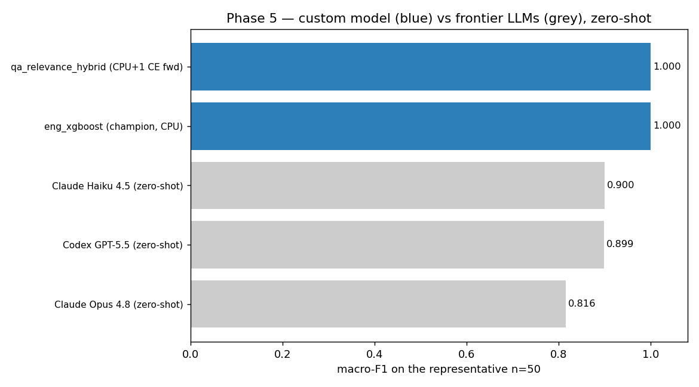
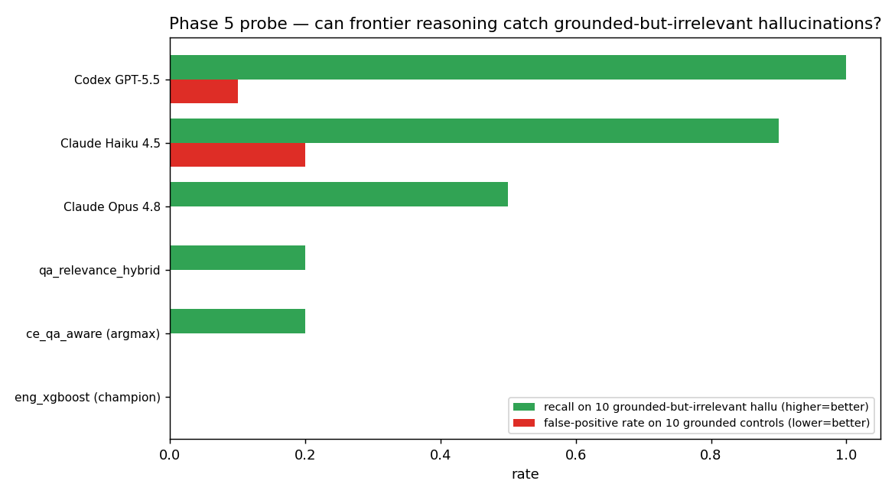
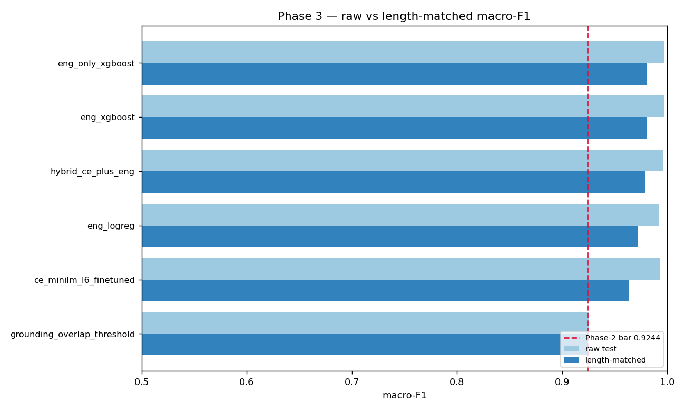
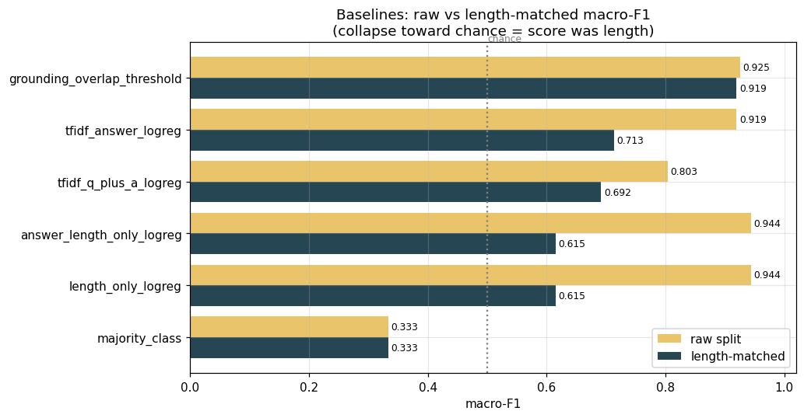
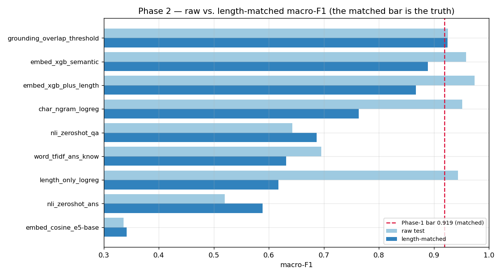
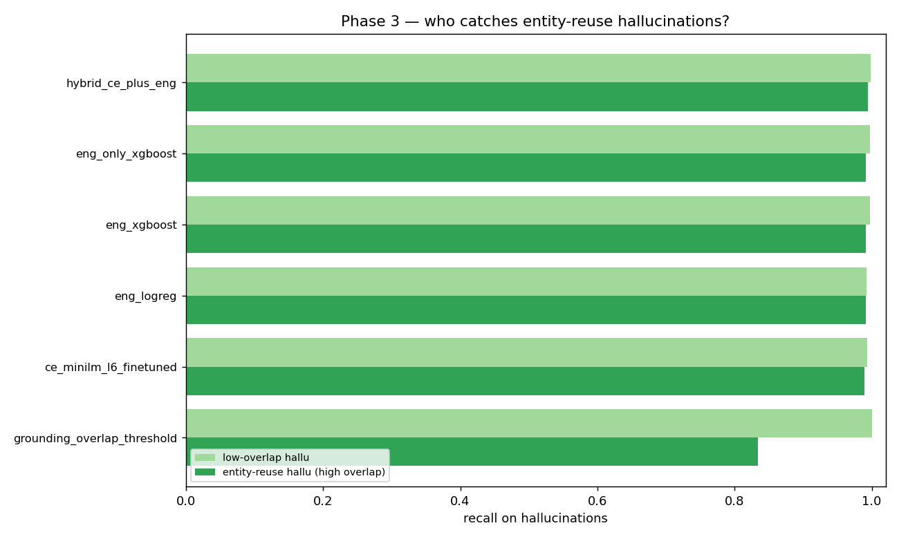
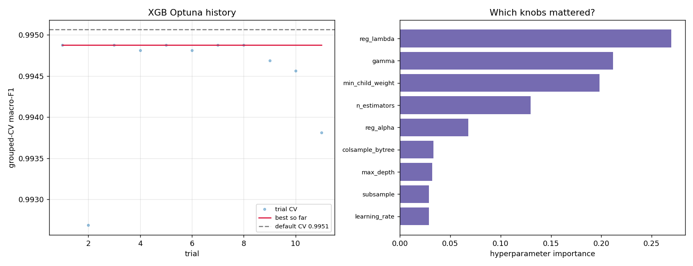
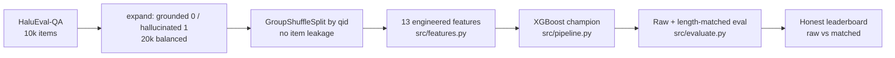

# AI Agent Conversation Quality Scorer

Detecting when an AI agent's answer is ungrounded or hallucinated relative to the source passage it was given. This is the load-bearing sub-problem of scoring agent conversation quality.

[](https://github.com/anthonyrodrigues443/AI-Agent-Conversation-Quality-Scorer/actions)

A 13-feature XGBoost that runs in 0.03 ms on CPU scores **0.9808 length-matched macro-F1** on [HaluEval-QA](https://github.com/RUCAIBox/HaluEval) (10k HotpotQA items, 20k balanced samples). On a held-out sample it beats zero-shot Claude Opus 4.8, Codex GPT-5.5, and Claude Haiku 4.5, at a fraction of their cost. Then the ablation: drop `lcs_char_ratio` (the longest common character run between answer and source) and macro-F1 falls by 0.074. Drop any of the other twelve features and it moves exactly 0.0000. The champion is a 1-feature model in disguise. Trust the length-matched number, not the raw one: this benchmark leaks answer length, and a length-only classifier rides that leak to 0.944 before collapsing to 0.615 under the matched control.

The winning pipeline is ported from the research notebooks to `src/` and covered by **48 offline tests**. Retraining on the frozen split reproduces the recorded results exactly: raw 0.9967, length-matched 0.9808.

| Model | Raw macro-F1 | Length-matched macro-F1 |
|---|---:|---:|
| ChatGPT zero-shot (HaluEval paper, accuracy) | 0.626 | n/a |
| Length-only logreg (the shortcut) | 0.9437 | 0.6150 |
| Grounding-overlap threshold (1 line of code) | 0.9252 | 0.9244 |
| **eng_xgboost (this repo's `src/`)** | **0.9967** | **0.9808** |
| Best frontier LLM zero-shot (Claude Haiku 4.5)* | 0.900 | n/a |

\* Held-out stratified sample, n=50, where the tree scores 1.000 (Codex GPT-5.5: 0.899, Claude Opus 4.8: 0.816). Full table: `results/llm_vs_custom.csv`.

## Run it

```bash
git clone https://github.com/anthonyrodrigues443/AI-Agent-Conversation-Quality-Scorer.git
cd AI-Agent-Conversation-Quality-Scorer
pip install -r requirements-ci.txt    # numpy, pandas, scikit-learn, xgboost, pytest, ruff
pytest -q                             # 48 tests, all offline

python -m src download                # HaluEval-QA qa_data.json (~6 MB)
python -m src train    --model-dir models/eng_xgboost   # prints raw 0.9967 / matched 0.9808
python -m src evaluate --model-dir models/eng_xgboost
python -m src score    --model-dir models/eng_xgboost \
  --question "Who wrote Hamlet?" \
  --answer "Hamlet was written by Christopher Marlowe in 1590." \
  --knowledge "Hamlet is a tragedy written by William Shakespeare between 1599 and 1601."
# {"p_hallucinated": 1.0, "verdict": "hallucinated"}
```

## Why I built this

Scoring agent conversations needs a grounding check that runs on every message. A frontier-LLM judge does the job, but paying model prices per message kills the economics at any real volume, so I wanted to know how cheap the check could get before it stopped working. I also kept interrogating my own benchmark, because the first version of every result here was misleading: a length-matched control exposed the length shortcut, a form-ambiguous control exposed the overlap rule as a form detector, and a leave-one-out ablation exposed my 13-feature champion as a 1-feature model. What survived is a tree that costs about nothing and wins the average, plus one hard slice (right text, wrong answer to the question) where only a frontier model wins. That slice, not the headline number, is the open problem.

## The full research log

**Dataset:** [HaluEval-QA](https://github.com/RUCAIBox/HaluEval) (Li et al., EMNLP 2023) — 10k
HotpotQA items, each with a grounded and a ChatGPT-hallucinated answer → a balanced 20k-sample binary
task. **Primary metric:** macro-F1. **Reference point:** the HaluEval paper's ChatGPT zero-shot =
**62.6% accuracy**.

### Headline (Phase 5 — latest)

> **My 13-feature CPU model beats Claude Opus 4.8, Claude Haiku 4.5, and Codex GPT-5.5 at catching AI hallucinations — except on the one slice that needs reasoning, where only the frontier wins.**
> On a held-out stratified sample the tiny tree scores a **perfect 1.000** macro-F1 vs **Opus 0.816 / Codex 0.899 / Haiku 0.900** (all zero-shot), at **0.03 ms** and **$0.0001/1k** — 3,500× to 500,000× cheaper. Then I ablated it: drop `lcs_char_ratio` and macro-F1 craters −0.074; drop *any of the other twelve* features and it moves **0.0000**. It was a **1-feature model in disguise** all along.
> The mirror twist: on the 10 "grounded-but-irrelevant" hallucinations (verbatim-correct text, *wrong answer to the question*) the tree catches **0/10** and a cross-encoder fine-tuned on the exact task only **2/10** — but **Codex GPT-5.5 catches 10/10**, Haiku 9/10, Opus 5/10. The model that loses the average wins the slice that needs to *read the question*. And putting the question inside my own encoder? It made the classifier **worse** (−0.025) — though its probability is still the #2 feature in the hybrid that finally nudges the ceiling to **0.9860**.
> **Production answer: a router — but it isn't cheap, and that's the real finding.** Tree on 100% of traffic (~free); route the `is_substr==1` "looks-grounded" suspects to an LLM. A second-model (Codex) review caught my first framing: that trigger is **~48% of HaluEval (1,915/4,000)**, not a minority, and at the LLM's measured false-alarm rate it would inject ~190 new false positives to rescue 10 hallucinations. The cheap signal that flags the suspects (verbatim overlap) also flags every *correct* verbatim answer — so grounded-but-irrelevant detection is genuinely expensive, and a tighter trigger is the open problem (Phase 6).




### Headline (Phase 3)

> **Phase 2 said a one-line lexical rule beats everything. Phase 3 says: that rule was mostly a *form* detector.**
> Engineered claim-relation features hit **0.9808** length-matched macro-F1 (the Phase-2 bar was 0.9244) — and
> dropping the old overlap feature changes *nothing* (0.9808 → 0.9808): the new features subsume it. A single
> feature, the longest common *token run* between answer and passage, beats the bar alone (0.9843).
> Then the twist: I fine-tuned the 22M cross-encoder the zero-shot NLI version *lost* with in Phase 2 — it jumps
> from **0.687 → 0.963**, past the lexical rule. And the honesty check seals it — on answers where the grounded
> text **isn't a verbatim span** (so "form" can't leak the label), the old overlap champion **collapses to 0.33
> (chance)** while the fine-tuned cross-encoder holds at **0.99**. The thing that actually *reads grounding* was
> the trained model all along; the lexical rule was reading answer shape.
> On the entity-reuse hallucinations overlap missed (175 of them), the hybrid catches **99.4%** and rescues **96.6%**.



### Headline (Phase 1)

> **HaluEval-QA is mostly solvable by counting characters — so I built a length-matched control to find out what's real.**
> A length-only classifier scores **0.944 macro-F1** on the raw split (vs the paper's 0.626 accuracy for ChatGPT — a fair beat: on this balanced task macro-F1≈accuracy, so the length model is 0.944 on both).
> But on a length-matched control it **collapses to 0.615** — basically chance. The drop *is* the shortcut.
> The twist: token-overlap with the source, which I assumed was just length in disguise (it correlates at
> ρ=−0.52), **holds at 0.919** when length is matched. The control is a truth serum — it cleanly separates
> the shortcut features from the one cheap baseline that actually reads the source.



### Phase 1 — honest leaderboard (ranked by length-matched macro-F1)

| Rank | Model | matched F1 | raw F1 | Δ drop | reads source? |
|---:|---|---:|---:|---:|:--:|
| 1 | grounding_overlap_threshold | **0.9192** | 0.9252 | −0.006 | ✅ |
| 2 | tfidf_answer_logreg | 0.7131 | 0.9194 | −0.206 | ❌ |
| 3 | tfidf_q_plus_a_logreg | 0.6915 | 0.8035 | −0.112 | ❌ |
| 4 | length_only_logreg | 0.6150 | 0.9437 | −0.329 | ❌ |
| 5 | answer_length_only_logreg | 0.6150 | 0.9435 | −0.329 | ❌ |
| 6 | majority_class | 0.3333 | 0.3333 | 0.000 | — |

**The bar Phase 2+ must beat is 0.919 (matched), not the inflated 0.944 (raw).**

### Key findings

1. **The benchmark leaks length.** Hallucinated answers are ~4.8× longer (95% end in punctuation vs 1%
   of grounded). A length-only model rides that to 0.944 raw, 0.615 matched.
2. **Only the answer's length matters** — question/knowledge lengths are constant within a matched pair,
   so the 2-feature answer-length model equals the 4-feature one.
3. **Grounding-overlap is genuine signal, not a length artifact** — I was wrong to assume otherwise; the
   matched control vindicated it (0.925 → 0.919). It's the honest floor.
4. **Adding the question hurts** (0.919 → 0.804): shared tokens are non-discriminative noise.
5. **(Phase 2) Richer paradigms can't beat the 1-line rule.** Six paradigms — three embedding encoders and a 184M-param zero-shot NLI cross-encoder — all collapse to overlap under length matching (champion holds at 0.9244). NLI even *inverts*, scoring hallucinations as more-entailed than grounded answers. The bottleneck is features, not models.
6. **(Phase 3) The right features beat the bar — and a fine-tuned cross-encoder finally reads grounding.** Engineered claim-relation features reach **0.9808** matched (vs 0.9244), and an *engineered-only* model that drops the Phase-2 overlap feature ties it exactly — the features subsume the old champion. Fine-tuning lifts the cross-encoder from the zero-shot floor (0.687) to **0.963**. The self-correction: on a **form-ambiguous** control (grounded answer isn't a verbatim span), the overlap champion **collapses to 0.33** while the fine-tuned CE holds at 0.99 — overlap was substantially a *form* detector, the trained model reads grounding.
7. **(Phase 4) Every lever is exhausted — the ceiling is structural.** Optuna moves matched-F1 by **+0.0000**; XGBoost = LightGBM = CatBoost land at *exactly* 0.9967/0.9808; the uncalibrated tree is already calibrated (ECE 0.0041, Platt makes it 2.5× worse); the learning curve is flat after 800 rows. 10/12 residual misses are verbatim-but-wrong answers — the ceiling is **question-relevance, not grounding**.
8. **(Phase 5) A 1-feature model that beats frontier LLMs on average but loses the slice that needs reasoning.** Leave-one-out: only `lcs_char_ratio` matters (−0.074; the other 12 are Δ=0.0000). Zero-shot, the 0.03 ms CPU tree scores **1.000** macro-F1 vs Opus 0.816 / Codex 0.899 / Haiku 0.900 — yet is **0/10** on grounded-but-irrelevant hallucinations where **Codex GPT-5.5 is 10/10**. The production answer is a router (tree everywhere + LLM on verbatim suspects); since the `is_substr` trigger is ~48% of traffic, relevance detection is genuinely expensive.

### Iteration Summary

#### Phase 1: Domain Research + Baselines + Length-Matched Control — 2026-06-08

<table>
<tr>
<td valign="top" width="38%">

**What was tested:** Five baselines + a length-asymmetry probe on HaluEval-QA (20k balanced samples, leak-free GroupShuffleSplit by qid). Headline metric: a 4-feature length-only LogReg hit **0.944 raw macro-F1** vs the paper's 0.626 ChatGPT zero-shot.<br><br>
**What worked best:** `grounding_overlap_threshold` — the only baseline that reads the source — at **0.919 matched macro-F1**, because it barely moves (−0.006) under the length-matched control while every length model falls off a cliff.

</td>
<td align="center" width="24%">


</td>
<td valign="top" width="38%">

**Key Insight:** A length-matched control (answer-length KS 0.874→0.123) is a truth serum — length-only collapses to **0.615** (≈chance) while overlap holds at 0.919. The −0.33 F1 drop *is* the shortcut, made visible.<br><br>
**Surprise:** Grounding-overlap, which I'd dismissed as length-in-disguise (ρ=−0.52 with length), survived matching intact — at equal lengths grounded answers still overlap the source far more. My going-in assumption was falsified.<br><br>
**Research:** Li et al., 2023 (HaluEval) — ChatGPT zero-shot = 62.6%, used as the reference floor. "The Illusion of Progress", 2025 — hallucinated text is systematically longer and detectors silently exploit length, so we built a length-matched control to isolate real signal.<br><br>
**Best Model So Far:** `grounding_overlap_threshold` — 0.919 matched macro-F1 (the honest floor Phase 2+ must beat).

</td>
</tr>
</table>

#### Phase 2: Multi-Paradigm Showdown — Lexical vs. Meaning — 2026-06-09

<table>
<tr>
<td valign="top" width="38%">

**What was tested:** Six paradigms across the lexical→semantic spectrum (char/word n-grams, sentence-embedding cosine ± XGBoost, a 184M-param zero-shot DeBERTa-v3 NLI cross-encoder) on the frozen Phase-1 split, each scored raw **and** on a rigorous nearest-length matched control (answer-length KS 0.874→0.122). The question: with the length crutch gone, does a model that reads *meaning* beat the 1-line overlap rule?<br><br>
**What worked best:** Nothing beat it — `grounding_overlap_threshold` stays champion at **0.9244 matched macro-F1** (drop just 0.0008), clearing the 0.919 bar, because every richer model collapses to overlap once length is matched (XGBoost importance: overlap 0.942 vs embeddings ≈ 0).

</td>
<td align="center" width="24%">



</td>
<td valign="top" width="38%">

**Key Insight:** The bottleneck is **features, not models** — every learned paradigm collapses to the lexical-overlap signal; a 184M-param zero-shot NLI model and three embedding encoders all fail to beat a one-line rule.<br><br>
**Surprise:** Hypothesis inverted — zero-shot NLI lands near the *bottom*. It assigns *higher* entailment to hallucinations (0.258) than to grounded answers (0.208): bare-entity spans ("Arthur's Magazine") read as non-entailed while fluent entity-reusing hallucinations read as entailed. NLI is confounded by answer **form** — the mirror image of the length shortcut.<br><br>
**Research:** Laban et al., 2022 (SummaC) — NLI-as-factual-consistency is the textbook zero-shot grounding check, so we tested it and it failed on built-to-be-grounded hallucinations. "Representation-based detectors fail OOD," 2025 — a never-trained-on-HaluEval detector is the cleanest test of transferable signal, so we ran NLI/embeddings zero-shot.<br><br>
**Best Model So Far:** `grounding_overlap_threshold` — 0.9244 matched macro-F1 (still the champion Phase 3 must beat).

</td>
</tr>
</table>

#### Phase 3: Feature Engineering + a Fine-Tuned Cross-Encoder — 2026-06-10

<table>
<tr>
<td valign="top" width="38%">

**What was tested:** 12 engineered claim-relation features (verbatim-span grounding, numeric/date, sentence-concentration, IDF-weighted overlap, negation), a combined LogReg/XGB head, and a **HaluEval-fine-tuned** 22M cross-encoder (`ms-marco-MiniLM-L-6-v2`) — all on the frozen split + the same nearest-length matched control (n=572). The bar: beat Phase-2 overlap (0.9244 matched) and catch the 175 entity-reuse hallucinations it missed.<br><br>
**What worked best:** `eng_xgboost` at **0.9808 matched** (+0.056 over the bar); the hybrid CE⊕eng gets the best hallucination recall (0.9755) and rescues **96.6%** of overlap's 175 misses.

</td>
<td align="center" width="24%">



</td>
<td valign="top" width="38%">

**Key Insight:** The bottleneck was **features, not models** — an engineered-only model (no overlap feature) ties the full one at 0.9808, so the new features *subsume* the Phase-2 champion. A single feature, longest common token run, beats the bar alone (0.9843).<br><br>
**Surprise (self-correction):** On a **form-ambiguous** control (grounded answer isn't a verbatim span), the Phase-2 overlap champion **collapses to 0.33 (chance)** while the fine-tuned cross-encoder holds at **0.99**. Overlap was substantially a *form* detector; the trained model reads grounding. Fine-tuning also lifts the CE from the zero-shot floor 0.687 → **0.963**.<br><br>
**Research:** Belyi et al., 2024 (Luna) + "On a Scale from 1 to 5", 2024 — fine-tuned cross-encoders beat zero-shot/LLMs in-domain, so we fine-tuned on HaluEval's own supervision. "Beyond ROUGE", 2025 + HALT-RAG, 2025 — engineered lexical features + a learned head over overlap⊕NLI.<br><br>
**Best Model So Far:** `eng_xgboost` / hybrid — **0.9808 matched macro-F1** (the champion Phase 4 must beat).

</td>
</tr>
</table>

#### Phase 4: Hyperparameter Tuning, Calibration & Error Analysis — 2026-06-11

<table>
<tr>
<td valign="top" width="38%">

**What was tested:** Whether *any* lever moves a feature-bound champion — Optuna over 9 XGBoost knobs, a gradient-boosting family head-to-head (LightGBM/CatBoost), calibration (Platt/isotonic), an operating-point sweep, and a learning curve — all on the frozen split + the length-matched control (n=572). Headline metric: 11 Optuna trials moved matched macro-F1 by **+0.0000** (CV −0.0002).<br><br>
**What worked best:** Nothing beat the Phase-3 default — `eng_xgboost` = LightGBM = CatBoost land on the *exact* same **0.9967 raw / 0.9808 matched**, and a tuned linear head is within 0.0018. The learner is interchangeable once the features exist.

</td>
<td align="center" width="24%">



</td>
<td valign="top" width="38%">

**Key Insight:** The ceiling is **structural, not tunable** — every lever (hyperparameters, model family, calibration, threshold, 20× data) is exhausted. The top-10 Optuna trials are a flat ridge across depth 3→10 and 200→800 trees; the model is feature-bound, proven by exhaustion.<br><br>
**Surprise:** Counter to the textbook, the uncalibrated tree is *already* calibrated (ECE 0.0041) — isotonic does nothing and Platt makes it **2.5× worse**. And 10 of 12 residual misses are verbatim substrings of the passage scored P≈0.01: **grounded-but-irrelevant** (right text, wrong answer to the question) — a mode no grounding feature can catch.<br><br>
**Research:** Niculescu-Mizil & Caruana, 2005 — boosted trees are classically mis-calibrated, so we tested Platt/isotonic; it backfired here. "The Mirage of Hallucination Detection", EMNLP-Findings 2025 — trained detectors are shift-sensitive, so we kept a form-ambiguous honesty slice.<br><br>
**Best Model So Far:** `eng_xgboost` — **0.9808 matched macro-F1** (unchanged; the residual ceiling is question-relevance, the Phase-5 target).

</td>
</tr>
</table>

#### Phase 5: Advanced Techniques + Ablation + Frontier-LLM Head-to-Head — 2026-06-12

<table>
<tr>
<td valign="top" width="38%">

**What was tested:** A question-aware cross-encoder + QA-relevance hybrid, a leave-one-feature-out ablation of all 13 features, and a zero-shot head-to-head vs **Claude Opus 4.8 / Haiku 4.5 / Codex GPT-5.5** (representative n=50 + a 10-case grounded-but-irrelevant probe). Headline metric: the CPU tree scored a **perfect 1.000** macro-F1 on n=50 vs Opus 0.816 / Codex 0.899 / Haiku 0.900.<br><br>
**What worked best:** The `eng_xgboost` champion still wins the average at **0.03 ms** and **$0.0001/1k** (3,500×–500,000× cheaper than any frontier model); the QA-CE probability as a *soft* feature nudges a hybrid to **0.9860 matched**.

</td>
<td align="center" width="24%">


</td>
<td valign="top" width="38%">

**Key Insight:** Lexical grounding is a commodity a 1-feature tree nails for ~free; **relevance is reasoning you still pay a frontier model for.** The tree wins the representative distribution but is **0/10** on grounded-but-irrelevant hallucinations where **Codex GPT-5.5 is 10/10** (Haiku 9, Opus 5).<br><br>
**Surprise:** Leave-one-out proved the 13-feature champion is a **1-feature model in disguise** — dropping `lcs_char_ratio` costs −0.074, dropping *any* of the other twelve costs exactly **0.0000**. And putting the question inside the encoder (the "obvious" fix) made the standalone classifier *worse* (−0.025).<br><br>
**Research:** Belyi et al., 2024 (Luna) — a small fine-tuned CE conditioned on query+context beats LLM judges at ~100–1000× lower cost, motivating the QA-aware CE + cost framing. QAFactEval / QuestEval lineage — relevance is undecidable without the question, so we put the question in the encoder.<br><br>
**Best Model So Far:** `qa_relevance_hybrid` — **0.9860 matched macro-F1** (nominal best, optimistically biased pending clean OOF stacking in Phase 6); `eng_xgboost` 0.9808 is the production champion.

</td>
</tr>
</table>

### Architecture


```mermaid
flowchart LR
    A[HaluEval-QA<br/>10k items] --> B[expand: grounded 0 / hallucinated 1<br/>20k balanced]
    B --> C[GroupShuffleSplit by qid<br/>no item leakage]
    C --> D[13 engineered features<br/>src/features.py]
    D --> E[XGBoost champion<br/>src/pipeline.py]
    E --> F[Raw + length-matched eval<br/>src/evaluate.py]
    F --> G[Honest leaderboard<br/>raw vs matched]
```

### Repo layout

```
src/                                        # production port of the winning pipeline
  features.py                               #   the 13 engineered features (verbatim from phase 3)
  data.py                                   #   HaluEval-QA download + grounded/hallucinated pairing
  pipeline.py                               #   grouped split, champion XGBoost, save/load
  evaluate.py                               #   raw + length-matched evaluation
  __main__.py                               #   CLI: download / train / evaluate / score
tests/                                      # 48 offline pytest tests
notebooks/phase1_eda_baselines.ipynb        # Phase 1 experiment (executed, 40 cells)
notebooks/phase2_multimodel.ipynb           # Phase 2 — six paradigms × raw vs matched
notebooks/phase3_features_crossencoder.ipynb # Phase 3 — engineered features + fine-tuned CE
notebooks/phase4_tuning.ipynb               # Phase 4: Optuna, calibration, error analysis
notebooks/phase5_advanced_llm.ipynb         # Phase 5: ablation + frontier-LLM head-to-head
config/config.yaml                          # dataset, split, metric config
data/README.md                              # HaluEval-QA download + license
results/                                    # leaderboards (csv/json), metrics.json, figures
reports/day{1..5}_phase{1..5}_report.md     # full per-phase research reports
results/EXPERIMENT_LOG.md                   # cumulative master log
requirements.txt                            # full research environment (notebooks)
requirements-ci.txt                         # minimal src/ + tests environment
```

### Reproduce the notebooks

```bash
python3 -m venv --system-site-packages .venv && source .venv/bin/activate
pip install -r requirements.txt
python -m src download
jupyter nbconvert --to notebook --execute --inplace notebooks/phase1_eda_baselines.ipynb
```

### Roadmap

| Phase | Focus | Status |
|------:|-------|:------:|
| 1 | Domain research + dataset + EDA + baselines + length-matched control | ✅ |
| 2 | 4–6 paradigms (n-grams, SBERT, zero-shot NLI) × raw vs matched | ✅ |
| 3 | Feature engineering + fine-tuned cross-encoder + form-ambiguous control | ✅ |
| 4 | Hyperparameter tuning + error analysis | ✅ |
| 5 | Advanced techniques + ablation + **LLM head-to-head** (Claude/Codex) | ✅ |
| 6 | Production port: `src/` pipeline + CLI + tests + CI | ✅ |
| 7 | Streamlit UI + tighter router trigger for grounded-but-irrelevant | ⏳ |

### References

- Li et al. *HaluEval.* EMNLP 2023.
- *The Illusion of Progress: Re-evaluating Hallucination Detection in LLMs.* arXiv:2508.08285 (2025).
- *Representation-based Broad Hallucination Detectors Fail to Generalize OOD.* arXiv:2509.19372 (2025).
- Belyi et al. *Luna: An Evaluation Foundation Model to Catch LM Hallucinations with High Accuracy and Low Cost.* arXiv:2406.00975 (2024).
- *On a Scale from 1 to 5: Quantifying Hallucination in Faithfulness Evaluation.* arXiv:2410.12222 (2024).
- *Beyond ROUGE: N-Gram Subspace Features for LLM Hallucination Detection.* arXiv:2509.05360 (2025).
- *HALT-RAG: Hallucination Detection with Calibrated NLI Ensembles and Abstention.* arXiv:2509.07475 (2025).
