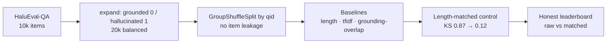

# AI Agent Conversation Quality Scorer

Detecting when an AI agent's answer is **ungrounded / hallucinated** vs. faithful to the source it was
given — the load-bearing sub-problem of any agent **conversation-quality** scorer. Built as a research
log: multiple approaches compared, the benchmark itself interrogated, and findings corrected when the
data disagreed with my assumptions.

**Dataset:** [HaluEval-QA](https://github.com/RUCAIBox/HaluEval) (Li et al., EMNLP 2023) — 10k
HotpotQA items, each with a grounded and a ChatGPT-hallucinated answer → a balanced 20k-sample binary
task. **Primary metric:** macro-F1. **Reference point:** the HaluEval paper's ChatGPT zero-shot =
**62.6% accuracy**.

---

## Headline (Phase 1)

> **HaluEval-QA is mostly solvable by counting characters — so I built a length-matched control to find out what's real.**
> A length-only classifier scores **0.944 macro-F1** on the raw split (vs the paper's 0.626 accuracy for ChatGPT — a fair beat: on this balanced task macro-F1≈accuracy, so the length model is 0.944 on both).
> But on a length-matched control it **collapses to 0.615** — basically chance. The drop *is* the shortcut.
> The twist: token-overlap with the source, which I assumed was just length in disguise (it correlates at
> ρ=−0.52), **holds at 0.919** when length is matched. The control is a truth serum — it cleanly separates
> the shortcut features from the one cheap baseline that actually reads the source.


## Phase 1 — honest leaderboard (ranked by length-matched macro-F1)

| Rank | Model | matched F1 | raw F1 | Δ drop | reads source? |
|---:|---|---:|---:|---:|:--:|
| 1 | grounding_overlap_threshold | **0.9192** | 0.9252 | −0.006 | ✅ |
| 2 | tfidf_answer_logreg | 0.7131 | 0.9194 | −0.206 | ❌ |
| 3 | tfidf_q_plus_a_logreg | 0.6915 | 0.8035 | −0.112 | ❌ |
| 4 | length_only_logreg | 0.6150 | 0.9437 | −0.329 | ❌ |
| 5 | answer_length_only_logreg | 0.6150 | 0.9435 | −0.329 | ❌ |
| 6 | majority_class | 0.3333 | 0.3333 | 0.000 | — |

**The bar Phase 2+ must beat is 0.919 (matched), not the inflated 0.944 (raw).**

## Key findings
1. **The benchmark leaks length.** Hallucinated answers are ~4.8× longer (95% end in punctuation vs 1%
   of grounded). A length-only model rides that to 0.944 raw, 0.615 matched.
2. **Only the answer's length matters** — question/knowledge lengths are constant within a matched pair,
   so the 2-feature answer-length model equals the 4-feature one.
3. **Grounding-overlap is genuine signal, not a length artifact** — I was wrong to assume otherwise; the
   matched control vindicated it (0.925 → 0.919). It's the honest floor.
4. **Adding the question hurts** (0.919 → 0.804): shared tokens are non-discriminative noise.
5. **(Phase 2) Richer paradigms can't beat the 1-line rule.** Six paradigms — three embedding encoders and a 184M-param zero-shot NLI cross-encoder — all collapse to overlap under length matching (champion holds at 0.9244). NLI even *inverts*, scoring hallucinations as more-entailed than grounded answers. The bottleneck is features, not models.

## Iteration Summary

### Phase 1: Domain Research + Baselines + Length-Matched Control — 2026-06-08

<table>
<tr>
<td valign="top" width="38%">

**What was tested:** Five baselines + a length-asymmetry probe on HaluEval-QA (20k balanced samples, leak-free GroupShuffleSplit by qid). Headline metric: a 4-feature length-only LogReg hit **0.944 raw macro-F1** vs the paper's 0.626 ChatGPT zero-shot.<br><br>
**What worked best:** `grounding_overlap_threshold` — the only baseline that reads the source — at **0.919 matched macro-F1**, because it barely moves (−0.006) under the length-matched control while every length model falls off a cliff.

</td>
<td align="center" width="24%">


</td>
<td valign="top" width="38%">

**Key Insight:** A length-matched control (answer-length KS 0.874→0.123) is a truth serum — length-only collapses to **0.615** (≈chance) while overlap holds at 0.919. The −0.33 F1 drop *is* the shortcut, made visible.<br><br>
**Surprise:** Grounding-overlap, which I'd dismissed as length-in-disguise (ρ=−0.52 with length), survived matching intact — at equal lengths grounded answers still overlap the source far more. My going-in assumption was falsified.<br><br>
**Research:** Li et al., 2023 (HaluEval) — ChatGPT zero-shot = 62.6%, used as the reference floor. "The Illusion of Progress", 2025 — hallucinated text is systematically longer and detectors silently exploit length, so we built a length-matched control to isolate real signal.<br><br>
**Best Model So Far:** `grounding_overlap_threshold` — 0.919 matched macro-F1 (the honest floor Phase 2+ must beat).

</td>
</tr>
</table>

### Phase 2: Multi-Paradigm Showdown — Lexical vs. Meaning — 2026-06-09

<table>
<tr>
<td valign="top" width="38%">

**What was tested:** Six paradigms across the lexical→semantic spectrum (char/word n-grams, sentence-embedding cosine ± XGBoost, a 184M-param zero-shot DeBERTa-v3 NLI cross-encoder) on the frozen Phase-1 split, each scored raw **and** on a rigorous nearest-length matched control (answer-length KS 0.874→0.122). The question: with the length crutch gone, does a model that reads *meaning* beat the 1-line overlap rule?<br><br>
**What worked best:** Nothing beat it — `grounding_overlap_threshold` stays champion at **0.9244 matched macro-F1** (drop just 0.0008), clearing the 0.919 bar, because every richer model collapses to overlap once length is matched (XGBoost importance: overlap 0.942 vs embeddings ≈ 0).

</td>
<td align="center" width="24%">


</td>
<td valign="top" width="38%">

**Key Insight:** The bottleneck is **features, not models** — every learned paradigm collapses to the lexical-overlap signal; a 184M-param zero-shot NLI model and three embedding encoders all fail to beat a one-line rule.<br><br>
**Surprise:** Hypothesis inverted — zero-shot NLI lands near the *bottom*. It assigns *higher* entailment to hallucinations (0.258) than to grounded answers (0.208): bare-entity spans ("Arthur's Magazine") read as non-entailed while fluent entity-reusing hallucinations read as entailed. NLI is confounded by answer **form** — the mirror image of the length shortcut.<br><br>
**Research:** Laban et al., 2022 (SummaC) — NLI-as-factual-consistency is the textbook zero-shot grounding check, so we tested it and it failed on built-to-be-grounded hallucinations. "Representation-based detectors fail OOD," 2025 — a never-trained-on-HaluEval detector is the cleanest test of transferable signal, so we ran NLI/embeddings zero-shot.<br><br>
**Best Model So Far:** `grounding_overlap_threshold` — 0.9244 matched macro-F1 (still the champion Phase 3 must beat).

</td>
</tr>
</table>

## Architecture


```mermaid
flowchart LR
    A[HaluEval-QA<br/>10k items] --> B[expand: grounded 0 / hallucinated 1<br/>20k balanced]
    B --> C[GroupShuffleSplit by qid<br/>no item leakage]
    C --> D[Baselines<br/>length · tfidf · grounding-overlap]
    D --> E[Length-matched control<br/>KS 0.87 → 0.12]
    E --> F[Honest leaderboard<br/>raw vs matched]
```

## Repo layout
```
notebooks/phase1_eda_baselines.ipynb   # the Phase 1 experiment (executed, 40 cells)
config/config.yaml                     # dataset, split, metric config
data/README.md                         # HaluEval-QA download + license
results/                               # leaderboards (csv/json), metrics.json, figures
reports/day1_phase1_report.md          # full Phase 1 research report
results/EXPERIMENT_LOG.md              # cumulative master log
requirements.txt
```

## Reproduce
```bash
python3 -m venv --system-site-packages .venv && source .venv/bin/activate
pip install -r requirements.txt
mkdir -p data/raw && curl -s -o data/raw/qa_data.json \
  https://raw.githubusercontent.com/RUCAIBox/HaluEval/main/data/qa_data.json
jupyter nbconvert --to notebook --execute --inplace notebooks/phase1_eda_baselines.ipynb
```

## Roadmap
| Phase | Focus | Status |
|------:|-------|:------:|
| 1 | Domain research + dataset + EDA + baselines + length-matched control | ✅ |
| 2 | 4–6 paradigms (n-grams, SBERT, zero-shot NLI) × raw vs matched | ✅ |
| 3 | Feature engineering + top-model deep dive | ⏳ |
| 4 | Hyperparameter tuning + error analysis | ⏳ |
| 5 | Advanced techniques + ablation + **LLM head-to-head** (Claude/Codex) | ⏳ |
| 6 | Production pipeline + Streamlit UI | ⏳ |
| 7 | Tests + README polish + consolidation | ⏳ |

## References
- Li et al. *HaluEval.* EMNLP 2023.
- *The Illusion of Progress: Re-evaluating Hallucination Detection in LLMs.* arXiv:2508.08285 (2025).
- *Representation-based Broad Hallucination Detectors Fail to Generalize OOD.* arXiv:2509.19372 (2025).
