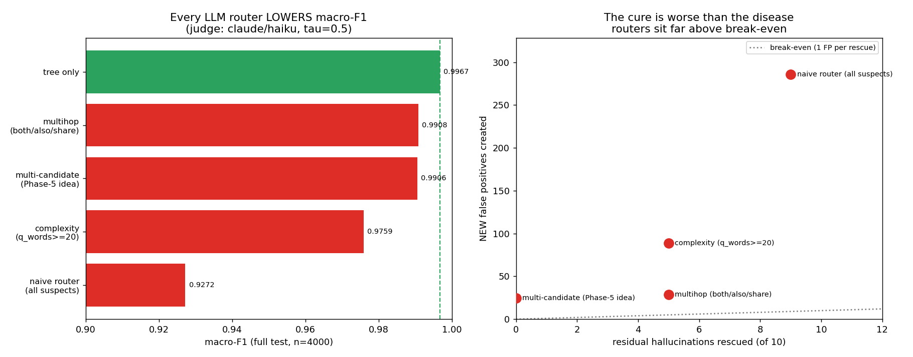
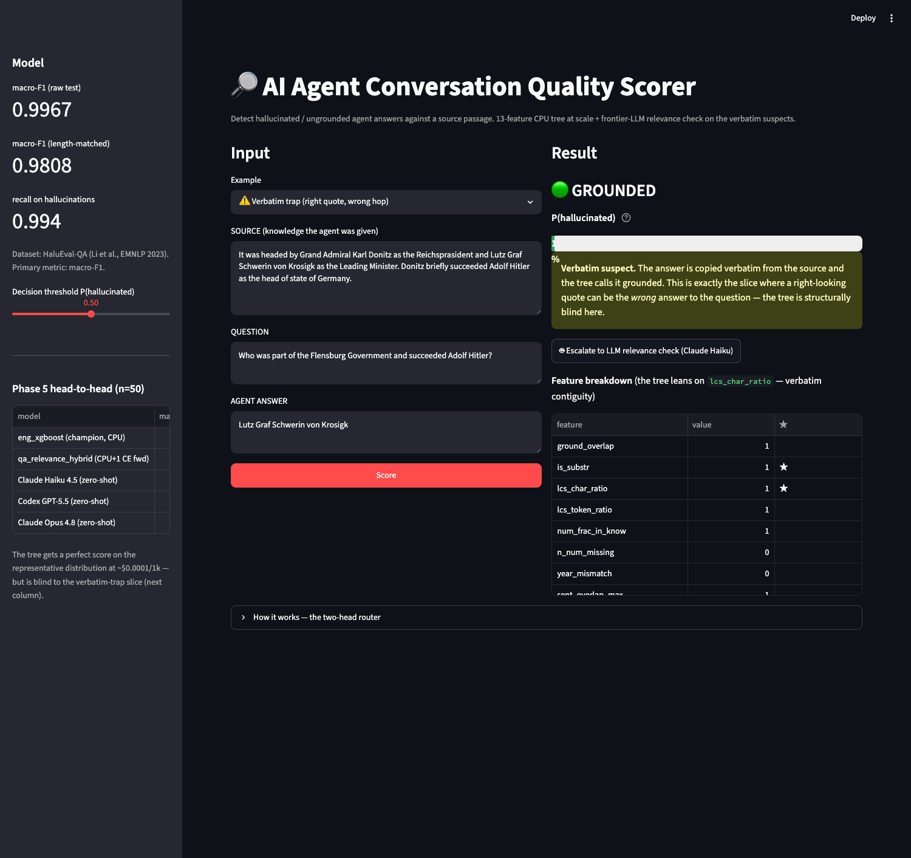
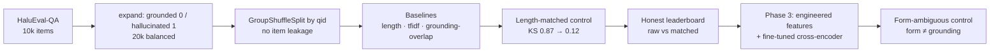

# AI Agent Conversation Quality Scorer

Detecting when an AI agent's answer is **ungrounded / hallucinated** vs. faithful to the source it was
given — the load-bearing sub-problem of any agent **conversation-quality** scorer. Built as a research
log: multiple approaches compared, the benchmark itself interrogated, and findings corrected when the
data disagreed with my assumptions.

**Dataset:** [HaluEval-QA](https://github.com/RUCAIBox/HaluEval) (Li et al., EMNLP 2023) — 10k
HotpotQA items, each with a grounded and a ChatGPT-hallucinated answer → a balanced 20k-sample binary
task. **Primary metric:** macro-F1. **Reference point:** the HaluEval paper's ChatGPT zero-shot =
**62.6% accuracy**.

---

## Headline (Phase 6 — latest)

> **I built the LLM router everyone recommends to cover my model's blind spot. It made the system *worse* — at every setting, with every model I tried. The corrected answer: ship the tree alone.**
> Phase 5 ended on "ship both": my 0.3 MB tree for the 99.75% it nails, a frontier LLM for the 10 verbatim-but-irrelevant hallucinations it's blind to. Phase 6 actually built that router and measured it on all **4,000** test rows. **Every routing policy LOWERED macro-F1.** The naive router (escalate every verbatim suspect) rescues 9/10 hallucinations — and manufactures **287 new false positives** doing it (precision 0.9995 → 0.874, macro-F1 0.9967 → 0.927). Even **Codex GPT-5.5, which catches 10/10**, drops macro-F1 to **0.9194** by creating ~318 false positives at ~$24/1k.
> **Why:** the 10 hallucinations hide in a pool of 1,915 verbatim answers that is **99.5% correct**, so any LLM false-alarm rate above ~0.5% costs more than it saves. And the trigger I expected to fix it — Phase 5's "multi-candidate questions only" — catches **0/10**: the residual is *single-candidate multi-hop* questions (the verbatim answer is the wrong **hop**), not comparative ones. A deferral cascade only pays when the hard slice is error-enriched; here it's a needle in a haystack of correct answers, and **no cheap lexical rule finds the needle — because relevance is reasoning.** That's not a bug in the router; it's the thesis, quantified.




## Headline (Phase 5)

> **My 13-feature CPU model beats Claude Opus 4.8, Claude Haiku 4.5, and Codex GPT-5.5 at catching AI hallucinations — except on the one slice that needs reasoning, where only the frontier wins.**
> On a held-out stratified sample the tiny tree scores a **perfect 1.000** macro-F1 vs **Opus 0.816 / Codex 0.899 / Haiku 0.900** (all zero-shot), at **0.03 ms** and **$0.0001/1k** — 3,500× to 500,000× cheaper. Then I ablated it: drop `lcs_char_ratio` and macro-F1 craters −0.074; drop *any of the other twelve* features and it moves **0.0000**. It was a **1-feature model in disguise** all along.
> The mirror twist: on the 10 "grounded-but-irrelevant" hallucinations (verbatim-correct text, *wrong answer to the question*) the tree catches **0/10** and a cross-encoder fine-tuned on the exact task only **2/10** — but **Codex GPT-5.5 catches 10/10**, Haiku 9/10, Opus 5/10. The model that loses the average wins the slice that needs to *read the question*. And putting the question inside my own encoder? It made the classifier **worse** (−0.025) — though its probability is still the #2 feature in the hybrid that finally nudges the ceiling to **0.9860**.
> **Production answer: a router — but it isn't cheap, and that's the real finding.** Tree on 100% of traffic (~free); route the `is_substr==1` "looks-grounded" suspects to an LLM. A second-model (Codex) review caught my first framing: that trigger is **~48% of HaluEval (1,915/4,000)**, not a minority, and at the LLM's measured false-alarm rate it would inject ~190 new false positives to rescue 10 hallucinations. The cheap signal that flags the suspects (verbatim overlap) also flags every *correct* verbatim answer — so grounded-but-irrelevant detection is genuinely expensive, and a tighter trigger is the open problem (Phase 6).


## Headline (Phase 3)

> **Phase 2 said a one-line lexical rule beats everything. Phase 3 says: that rule was mostly a *form* detector.**
> Engineered claim-relation features hit **0.9808** length-matched macro-F1 (the Phase-2 bar was 0.9244) — and
> dropping the old overlap feature changes *nothing* (0.9808 → 0.9808): the new features subsume it. A single
> feature, the longest common *token run* between answer and passage, beats the bar alone (0.9843).
> Then the twist: I fine-tuned the 22M cross-encoder the zero-shot NLI version *lost* with in Phase 2 — it jumps
> from **0.687 → 0.963**, past the lexical rule. And the honesty check seals it — on answers where the grounded
> text **isn't a verbatim span** (so "form" can't leak the label), the old overlap champion **collapses to 0.33
> (chance)** while the fine-tuned cross-encoder holds at **0.99**. The thing that actually *reads grounding* was
> the trained model all along; the lexical rule was reading answer shape.
> On the entity-reuse hallucinations overlap missed (175 of them), the hybrid catches **99.4%** and rescues **96.6%**.


## Headline (Phase 1)

> **HaluEval-QA is mostly solvable by counting characters — so I built a length-matched control to find out what's real.**
> A length-only classifier scores **0.944 macro-F1** on the raw split (vs the paper's 0.626 accuracy for ChatGPT — a fair beat: on this balanced task macro-F1≈accuracy, so the length model is 0.944 on both).
> But on a length-matched control it **collapses to 0.615** — basically chance. The drop *is* the shortcut.
> The twist: token-overlap with the source, which I assumed was just length in disguise (it correlates at
> ρ=−0.52), **holds at 0.919** when length is matched. The control is a truth serum — it cleanly separates
> the shortcut features from the one cheap baseline that actually reads the source.


## Phase 1 — honest leaderboard (ranked by length-matched macro-F1)

| Rank | Model | matched F1 | raw F1 | Δ drop | reads source? |
|---:|---|---:|---:|---:|:--:|
| 1 | grounding_overlap_threshold | **0.9192** | 0.9252 | −0.006 | ✅ |
| 2 | tfidf_answer_logreg | 0.7131 | 0.9194 | −0.206 | ❌ |
| 3 | tfidf_q_plus_a_logreg | 0.6915 | 0.8035 | −0.112 | ❌ |
| 4 | length_only_logreg | 0.6150 | 0.9437 | −0.329 | ❌ |
| 5 | answer_length_only_logreg | 0.6150 | 0.9435 | −0.329 | ❌ |
| 6 | majority_class | 0.3333 | 0.3333 | 0.000 | — |

**The bar Phase 2+ must beat is 0.919 (matched), not the inflated 0.944 (raw).**

## Key findings
1. **The benchmark leaks length.** Hallucinated answers are ~4.8× longer (95% end in punctuation vs 1%
   of grounded). A length-only model rides that to 0.944 raw, 0.615 matched.
2. **Only the answer's length matters** — question/knowledge lengths are constant within a matched pair,
   so the 2-feature answer-length model equals the 4-feature one.
3. **Grounding-overlap is genuine signal, not a length artifact** — I was wrong to assume otherwise; the
   matched control vindicated it (0.925 → 0.919). It's the honest floor.
4. **Adding the question hurts** (0.919 → 0.804): shared tokens are non-discriminative noise.
5. **(Phase 2) Richer paradigms can't beat the 1-line rule.** Six paradigms — three embedding encoders and a 184M-param zero-shot NLI cross-encoder — all collapse to overlap under length matching (champion holds at 0.9244). NLI even *inverts*, scoring hallucinations as more-entailed than grounded answers. The bottleneck is features, not models.
6. **(Phase 3) The right features beat the bar — and a fine-tuned cross-encoder finally reads grounding.** Engineered claim-relation features reach **0.9808** matched (vs 0.9244), and an *engineered-only* model that drops the Phase-2 overlap feature ties it exactly — the features subsume the old champion. Fine-tuning lifts the cross-encoder from the zero-shot floor (0.687) to **0.963**. The self-correction: on a **form-ambiguous** control (grounded answer isn't a verbatim span), the overlap champion **collapses to 0.33** while the fine-tuned CE holds at 0.99 — overlap was substantially a *form* detector, the trained model reads grounding.

## Iteration Summary

### Phase 1: Domain Research + Baselines + Length-Matched Control — 2026-06-08

<table>
<tr>
<td valign="top" width="38%">

**What was tested:** Five baselines + a length-asymmetry probe on HaluEval-QA (20k balanced samples, leak-free GroupShuffleSplit by qid). Headline metric: a 4-feature length-only LogReg hit **0.944 raw macro-F1** vs the paper's 0.626 ChatGPT zero-shot.<br><br>
**What worked best:** `grounding_overlap_threshold` — the only baseline that reads the source — at **0.919 matched macro-F1**, because it barely moves (−0.006) under the length-matched control while every length model falls off a cliff.

</td>
<td align="center" width="24%">


</td>
<td valign="top" width="38%">

**Key Insight:** A length-matched control (answer-length KS 0.874→0.123) is a truth serum — length-only collapses to **0.615** (≈chance) while overlap holds at 0.919. The −0.33 F1 drop *is* the shortcut, made visible.<br><br>
**Surprise:** Grounding-overlap, which I'd dismissed as length-in-disguise (ρ=−0.52 with length), survived matching intact — at equal lengths grounded answers still overlap the source far more. My going-in assumption was falsified.<br><br>
**Research:** Li et al., 2023 (HaluEval) — ChatGPT zero-shot = 62.6%, used as the reference floor. "The Illusion of Progress", 2025 — hallucinated text is systematically longer and detectors silently exploit length, so we built a length-matched control to isolate real signal.<br><br>
**Best Model So Far:** `grounding_overlap_threshold` — 0.919 matched macro-F1 (the honest floor Phase 2+ must beat).

</td>
</tr>
</table>

### Phase 2: Multi-Paradigm Showdown — Lexical vs. Meaning — 2026-06-09

<table>
<tr>
<td valign="top" width="38%">

**What was tested:** Six paradigms across the lexical→semantic spectrum (char/word n-grams, sentence-embedding cosine ± XGBoost, a 184M-param zero-shot DeBERTa-v3 NLI cross-encoder) on the frozen Phase-1 split, each scored raw **and** on a rigorous nearest-length matched control (answer-length KS 0.874→0.122). The question: with the length crutch gone, does a model that reads *meaning* beat the 1-line overlap rule?<br><br>
**What worked best:** Nothing beat it — `grounding_overlap_threshold` stays champion at **0.9244 matched macro-F1** (drop just 0.0008), clearing the 0.919 bar, because every richer model collapses to overlap once length is matched (XGBoost importance: overlap 0.942 vs embeddings ≈ 0).

</td>
<td align="center" width="24%">


</td>
<td valign="top" width="38%">

**Key Insight:** The bottleneck is **features, not models** — every learned paradigm collapses to the lexical-overlap signal; a 184M-param zero-shot NLI model and three embedding encoders all fail to beat a one-line rule.<br><br>
**Surprise:** Hypothesis inverted — zero-shot NLI lands near the *bottom*. It assigns *higher* entailment to hallucinations (0.258) than to grounded answers (0.208): bare-entity spans ("Arthur's Magazine") read as non-entailed while fluent entity-reusing hallucinations read as entailed. NLI is confounded by answer **form** — the mirror image of the length shortcut.<br><br>
**Research:** Laban et al., 2022 (SummaC) — NLI-as-factual-consistency is the textbook zero-shot grounding check, so we tested it and it failed on built-to-be-grounded hallucinations. "Representation-based detectors fail OOD," 2025 — a never-trained-on-HaluEval detector is the cleanest test of transferable signal, so we ran NLI/embeddings zero-shot.<br><br>
**Best Model So Far:** `grounding_overlap_threshold` — 0.9244 matched macro-F1 (still the champion Phase 3 must beat).

</td>
</tr>
</table>

### Phase 3: Feature Engineering + a Fine-Tuned Cross-Encoder — 2026-06-10

<table>
<tr>
<td valign="top" width="38%">

**What was tested:** 12 engineered claim-relation features (verbatim-span grounding, numeric/date, sentence-concentration, IDF-weighted overlap, negation), a combined LogReg/XGB head, and a **HaluEval-fine-tuned** 22M cross-encoder (`ms-marco-MiniLM-L-6-v2`) — all on the frozen split + the same nearest-length matched control (n=572). The bar: beat Phase-2 overlap (0.9244 matched) and catch the 175 entity-reuse hallucinations it missed.<br><br>
**What worked best:** `eng_xgboost` at **0.9808 matched** (+0.056 over the bar); the hybrid CE⊕eng gets the best hallucination recall (0.9755) and rescues **96.6%** of overlap's 175 misses.

</td>
<td align="center" width="24%">


</td>
<td valign="top" width="38%">

**Key Insight:** The bottleneck was **features, not models** — an engineered-only model (no overlap feature) ties the full one at 0.9808, so the new features *subsume* the Phase-2 champion. A single feature, longest common token run, beats the bar alone (0.9843).<br><br>
**Surprise (self-correction):** On a **form-ambiguous** control (grounded answer isn't a verbatim span), the Phase-2 overlap champion **collapses to 0.33 (chance)** while the fine-tuned cross-encoder holds at **0.99**. Overlap was substantially a *form* detector; the trained model reads grounding. Fine-tuning also lifts the CE from the zero-shot floor 0.687 → **0.963**.<br><br>
**Research:** Belyi et al., 2024 (Luna) + "On a Scale from 1 to 5", 2024 — fine-tuned cross-encoders beat zero-shot/LLMs in-domain, so we fine-tuned on HaluEval's own supervision. "Beyond ROUGE", 2025 + HALT-RAG, 2025 — engineered lexical features + a learned head over overlap⊕NLI.<br><br>
**Best Model So Far:** `eng_xgboost` / hybrid — **0.9808 matched macro-F1** (the champion Phase 4 must beat).

</td>
</tr>
</table>

## Architecture


```mermaid
flowchart LR
    A[HaluEval-QA<br/>10k items] --> B[expand: grounded 0 / hallucinated 1<br/>20k balanced]
    B --> C[GroupShuffleSplit by qid<br/>no item leakage]
    C --> D[Baselines<br/>length · tfidf · grounding-overlap]
    D --> E[Length-matched control<br/>KS 0.87 → 0.12]
    E --> F[Honest leaderboard<br/>raw vs matched]
    F --> G[Phase 3: engineered features<br/>+ fine-tuned cross-encoder]
    G --> H[Form-ambiguous control<br/>form ≠ grounding]
```

## Production — the two-head scorer (Phase 6)

The champion ships as a 0.32 MB joblib bundle (model + fitted IDF table + threshold), reproducing the
research metrics exactly: raw macro-F1 **0.9967**, length-matched **0.9808**, hallucination recall 0.994.

```python
from src.predict import ConversationQualityScorer
scorer = ConversationQualityScorer.load()
scorer.score(knowledge="...", question="...", answer="...")
# -> {prob_hallucinated, verdict, features (13), is_verbatim, verbatim_suspect, ...}
```

**The router experiment (full test, n=4,000, τ=0.5).** Does escalating verbatim suspects to a frontier
LLM help? No — every policy lowers macro-F1, because the verbatim-suspect pool is 47.9% of traffic and
**99.5% verbatim-correct** answers:

| Policy | judge | macro-F1 | new FP | residual caught | routed | cost/1k |
|---|---|--:|--:|:--:|--:|--:|
| **tree only** | — | **0.9967** | 0 | 0/10 | 0% | $0.0001 |
| multihop router | Haiku 4.5 | 0.9908 | 30 | 5/10 | 4.9% | $0.015 |
| multi-candidate (Phase-5 idea) | Haiku 4.5 | 0.9906 | 26 | 0/10 | 4.1% | $0.013 |
| naive router | Haiku 4.5 | 0.9272 | 287 | 9/10 | 47.9% | $0.144 |
| naive router | Codex GPT-5.5 | 0.9194 | 318 | **10/10** | 47.9% | $24.0 |

**Run the demo** (Streamlit; live tree scoring + on-demand LLM relevance check on verbatim suspects):
```bash
streamlit run app.py
```

## Repo layout
```
src/                                         # Phase 6 production pipeline (importable)
  data_pipeline.py  feature_engineering.py   #   load + frozen split; the 13 features
  train.py  predict.py  evaluate.py          #   train champion; inference; eval suite
  router.py  llm_judge.py  router_eval.py    #   two-head router + frontier judge + blended eval
  plots.py  utils.py
app.py                                       # Streamlit two-head demo (Phase 6)
models/champion.joblib · model_card.md       # 0.32 MB bundle + model card
tests/                                        # 19 pytest (pipeline, features, predict, router)
notebooks/phase{1..5}_*.ipynb                # Phases 1-5 research (executed, with outputs)
config/config.yaml · data/README.md
results/                                      # leaderboards, metrics.json, figures, LLM caches
reports/day{1..6}_phase{1..6}_report.md       # full per-phase research reports
results/EXPERIMENT_LOG.md                     # cumulative master log
requirements.txt
```

## Reproduce
```bash
python3 -m venv --system-site-packages .venv && source .venv/bin/activate
pip install -r requirements.txt
mkdir -p data/raw && curl -s -o data/raw/qa_data.json \
  https://raw.githubusercontent.com/RUCAIBox/HaluEval/main/data/qa_data.json
jupyter nbconvert --to notebook --execute --inplace notebooks/phase1_eda_baselines.ipynb

# Phase 6 production pipeline
python -m src.train          # -> models/champion.joblib (reproduces matched-F1 0.9808)
python -m src.evaluate       # raw + length-matched metrics on the test split
python -m src.router_eval    # full-test router economics (cached LLM calls; idempotent)
python -m pytest tests/ -q   # 19 tests
streamlit run app.py         # the demo
```

## Roadmap
| Phase | Focus | Status |
|------:|-------|:------:|
| 1 | Domain research + dataset + EDA + baselines + length-matched control | ✅ |
| 2 | 4–6 paradigms (n-grams, SBERT, zero-shot NLI) × raw vs matched | ✅ |
| 3 | Feature engineering + fine-tuned cross-encoder + form-ambiguous control | ✅ |
| 4 | Hyperparameter tuning + error analysis (tuning was a no-op; ceiling is relevance) | ✅ |
| 5 | Advanced techniques + ablation + **LLM head-to-head** (Claude/Codex) | ✅ |
| 6 | Production pipeline + Streamlit UI + **blended router economics** | ✅ |
| 7 | Tests + README polish + consolidation | ✅ |

## References
- Li et al. *HaluEval.* EMNLP 2023.
- *The Illusion of Progress: Re-evaluating Hallucination Detection in LLMs.* arXiv:2508.08285 (2025).
- *Representation-based Broad Hallucination Detectors Fail to Generalize OOD.* arXiv:2509.19372 (2025).
- Belyi et al. *Luna: An Evaluation Foundation Model to Catch LM Hallucinations with High Accuracy and Low Cost.* arXiv:2406.00975 (2024).
- *On a Scale from 1 to 5: Quantifying Hallucination in Faithfulness Evaluation.* arXiv:2410.12222 (2024).
- *Beyond ROUGE: N-Gram Subspace Features for LLM Hallucination Detection.* arXiv:2509.05360 (2025).
- *HALT-RAG: Hallucination Detection with Calibrated NLI Ensembles and Abstention.* arXiv:2509.07475 (2025).
